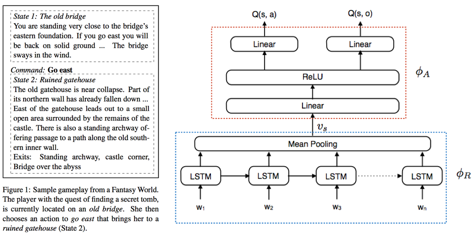

Text-based Games using Deep Reinforcement Learning
===================================================

Tensorflow implementation of [Language Understanding for Text-based Games using Deep Reinforcement Learning](http://arxiv.org/abs/1506.08941). The original code of author can be found [here](https://github.com/karthikncode/text-world-player).

Prerequisites
-------------

- Python 2.7 or Python 3.3+
- [Tensorflow](https://www.tensorflow.org/)

Usage
-----

(in progress)

References
----------

- [EMNLP 2015 slide](http://people.csail.mit.edu/karthikn/pdfs/mud-play15-slides.pdf)

Author
------

Taehoon Kim / [@carpedm20](http://carpedm20.github.io/)
